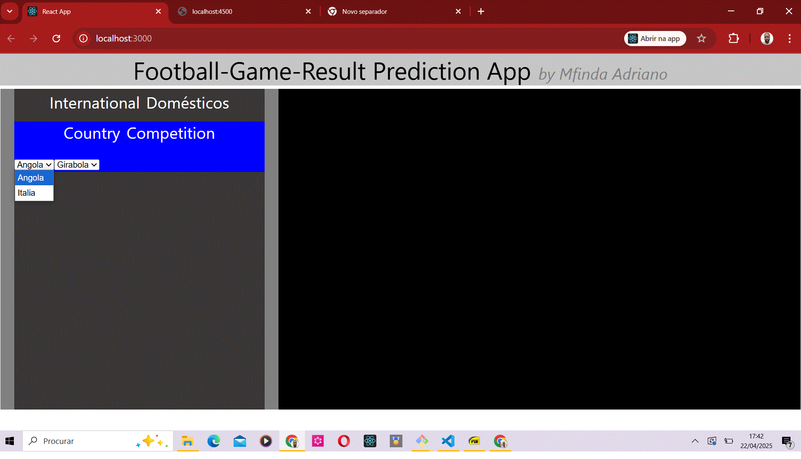

# football-game-results 

This application was developed with the final objective of finding all the results from football(soccer) matches between two selected teams based on data stored in our database, and from these results, one can have a clue about which one of these teams has more probability to win a future match.

The application has a database in which data related to games results between the two teams can be found, and these results are analysed and processed by the algorithm to try and determine which one of the two football teams has more probability to win a future game.
The application has a database in which data related to games results between the two teams can be found, and these results are analysed and processed by the algorithm to try and determine which one of the two football teams has more probability to win a future game.
The application has a database in which data related to games results between the two teams can be found, and these results are analysed and processed by the algorithm to try and determine which one of the two football teams has more probability to win a future game.
*  

##  Dev environment Demo  
[Live Demo](http://localhost:3000) | [Video Walkthrough](./appVideo.mp4)   

## Preview  
  

## Tech Stack  
- **Frontend:** React
 The frontend code was create using ReactJS and the styling was made using CSS Styling rules. To achieve the expected results, various React techniques were used such as Router(using BrowserRouter, Routes, Route and Link) for routing, Hooks (I used useState, useEffect and useRef hooks), etc 

- **Backend:** 
For backend implementation, Node.js, Express tools were used in this project to serve assets requested by the client.

- **Database:** 
MongoDB was the elected database technology for the present project since this technology uses JSON format which friendly to JavaScript. To manage data from and to the database object, async functions were used in order to use await for asynchronous implementation. 
  

## Features   
You can ask the application to suggest you which one of the two football team has more chance to win the game by chosing between:
    * International Competitions: where you can chose either the names of the two country disputing the game (e.g. France / Italy) and this will automatically select the International competition in which we find this two teams.

    *or by selecting the name of an International Competition and the application tells which countries belong to this Competition. 

## Installation 
 You can clone this project using the following command (assuming that you already have git installed in your computer)

1. git clone https://github.com/mfindaadriano/football-game-results.git  

To test the application in dev. environment, first install the dependencies using:
1. git clone
2. pnpm install 

then use either:
3. pnpm run react
4. pnpm run start

or use concurrently module to start both at once:
34. pnpm run fullstack
(which uses concurrently module)

Description of the role of the above command
- 1. To clone repo containing the project
- 2. To install the dependencies, or package (modules ) defined in package.json file
- 3. to start reactJS frontend server (http://locahost:3000)
- 4. to start backend nodeJS/Express Server (http://locahost:4500)
- 34. to start concurrently both frontend(react) and backend(nodeJS) servers

Deployment
The frontend app must be build before deployment using

> pnpm build

## Future Improvements  
- update the database in order to have more games' results available
- Add more search such as details related to players, goals, etc.
